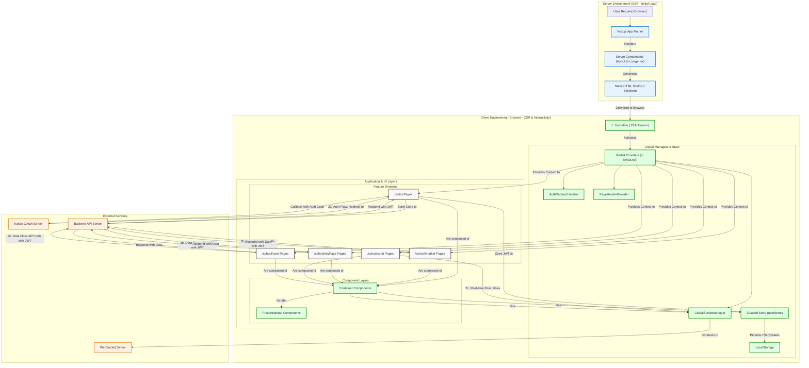

# SEMO - 우리 학교 학생들을 위한 중고거래 플랫폼

> Next.js 기반으로 구현된 대학교 커뮤니티 중심의 중고거래 웹 애플리케이션입니다. 같은 학교 학생 간의 신뢰를 바탕으로 안전하고 편리한 거래 경험을 제공합니다.

<!-- 메인 이미지: 서비스의 가장 메인 사진을 여기에 추가 -->


<!-- 서비스 개요 이미지: 서비스의 전체적인 흐름이나 컨셉을 보여주는 이미지를 추가 -->


## 서비스 소개

> **세모(SEMO)**는 같은 대학교 학생들을 위한 안전하고 활발한 중고거래 커뮤니티를 지향합니다. 복잡한 외부 중고거래 플랫폼과 달리, 학교 인증을 통해 형성된 신뢰를 기반으로 학생들이 전공 서적, 생활용품, 기기 등을 자유롭게 거래하고 소통할 수 있는 공간을 제공합니다.

### 🏫 학교 커뮤니티 중심의 거래

학교 이메일 인증을 통해 재학생 및 구성원만 이용할 수 있어 높은 신뢰도를 보장합니다. 익숙한 교내 또는 기숙사 주변에서의 직거래를 통해 빠르고 안전한 거래가 가능합니다.

### ⚡️ 실시간 채팅과 동적 UI

웹소켓 기반의 실시간 채팅으로 판매자와 구매자 간의 원활한 소통을 지원합니다. Next.js의 하이브리드 렌더링과 최적화된 데이터 로딩을 통해 사용자에게 빠르고 부드러운 UI/UX를 제공합니다.

### 📈 신뢰 기반의 사용자 평점 시스템

거래 후기 및 별점 시스템을 통해 판매자와 구매자 모두의 신뢰도를 가시적으로 확인할 수 있습니다. 이는 건전한 거래 문화를 조성하는 기반이 됩니다.

## 아키텍처 및 서비스 흐름



## 프로젝트 구조

```
src/
├── app/ # Next.js App Router 기반 라우팅 및 페이지
│   ├── (auth)/ # 로그인, 회원가입 등 인증 관련 페이지
│   ├── school/ # 인증 후 접근 가능한 핵심 기능 페이지
│   │   ├── market/ # 판매, 구매, 공동구매 등 거래 기능
│   │   ├── user/   # 다른 사용자 프로필 조회
│   │   ├── chat/   # 실시간 채팅
│   │   └── myPage/ # 내 정보 및 활동 관리
│   └── layout.tsx # 전역 레이아웃 및 프로바이더 설정
│
├── components/ # 재사용 가능한 UI 컴포넌트
│   ├── common/   # 헤더, 네비게이션 등 공통 컴포넌트
│   └── ui/       # 버튼, 인풋 등 원자적 UI 요소
│
├── contexts/ # React Context API (PageHeaderContext 등)
│
├── data/ # 데이터 fetching 관련 함수 및 로직
│
├── lib/ # 인증, 유틸리티 등 핵심 비즈니스 로직
│
├── store/ # Zustand를 사용한 전역 상태 관리 (userStore)
│
└── types/ # 프로젝트 전반에서 사용되는 TypeScript 타입 정의
```

## 기술 스택

| 분류           | 툴                                                                                                                                                                                                                                                                                                                                                                            |
| :------------- | :---------------------------------------------------------------------------------------------------------------------------------------------------------------------------------------------------------------------------------------------------------------------------------------------------------------------------------------------------------------------------- |
| **언어**       |                                                                                                                                                                                                                                                                       |
| **프레임워크** |                                                                                                                                                                                       |
| **스타일링**   |                                                                                                                                                                                                                                                                  |
| **상태 관리**  |                                                                                                                                                                                                                                                                                |
| **개발 환경**  |                                                                                                                                                                                                                                                      |
| **협업**       |     |

## 핵심 기능 및 흐름

1.  **온보딩 및 인증 (`/auth`)**
    - 카카오 소셜 로그인을 통한 간편한 회원가입 및 로그인
    - 학교 이메일 인증을 통해 재학생 신분 확인
    - Zustand를 통해 로그인 상태 및 사용자 정보를 전역으로 관리

2.  **중고 거래 (`/school/market`)**
    - 판매/구매/공동구매 탭으로 구분된 상품 목록 제공
    - 게시글 작성 및 이미지 업로드 기능

3.  **실시간 채팅 (`/school/chat`)**
    - 웹소켓(WebSocket)을 기반으로 판매자와 구매자 간의 1:1 실시간 대화를 지원합니다.
    - 이를 통해 거래 약속이나 상품에 대한 문의를 빠르고 편리하게 진행할 수 있습니다.

4.  **사용자 프로필 및 후기 (`/school/user/[id]`)**
    - 사용자의 판매/구매 내역 및 받은 거래 후기 확인
    - 클라이언트 캐싱을 통해 불필요한 API 호출을 최소화하여 페이지 로딩 성능 최적화

5.  **마이페이지 (`/school/myPage`)**
    - 나의 판매/구매/관심 목록 등 모든 활동 내역을 통합 관리
    - 프로필 정보(이미지, 닉네임) 수정 기능

## 주요 아키텍처 전략

- **하이브리드 렌더링 (SSR + CSR)**
  - Next.js의 App Router를 활용, 초기 진입 시 서버에서 페이지의 뼈대(Shell)를 렌더링(SSR)하여 빠른 로딩 속도를 확보합니다.
  - 이후 클라이언트에서 JavaScript가 활성화(Hydration)되면, 인증 정보가 필요한 동적 데이터를 비동기적으로 가져와(CSR) 화면을 완성합니다.

- **데이터 캐싱을 통한 성능 최적화**
  - 자주 변경되지 않는 데이터(예: 전체 회원 목록)는 최초 한 번만 API로 호출하고 클라이언트 스토어에 캐싱하여, 페이지 전환 시 발생하는 불필요한 네트워크 요청을 제거했습니다.

## 실행 방법

```bash
# 1. 저장소 복제
git clone [저장소 URL]

# 2. 디렉토리 이동
cd [프로젝트 폴더]

# 3. 의존성 설치
npm install

# 4. 개발 서버 실행
npm run dev
```

<!-- 로고 이미지: 프로젝트 로고 추가 -->


## 팀원 역할 분담

<!-- 팀원들의 이름과 주요 담당 역할을 아래 표에 채워주세요 -->

| 이름   | 주요 담당                            |
| :----- | :----------------------------------- |
| [이름] | 팀장, 백엔드 API 연동, 인증 총괄     |
| [이름] | 마켓(판매/구매) 기능, UI/UX 디자인   |
| [이름] | 마이페이지, 사용자 프로필, 채팅 기능 |
| [이름] | 아키텍처 설계, 성능 최적화, 배포     |

## 시연 이미지

<!-- 서비스의 주요 화면 스크린샷을 여기에 추가 -->

|                                로그인                                |                              메인 마켓                              |                               채팅                                |                                마이페이지                                 |
| :------------------------------------------------------------------: | :-----------------------------------------------------------------: | :---------------------------------------------------------------: | :-----------------------------------------------------------------------: |
|  |  |  |  |
